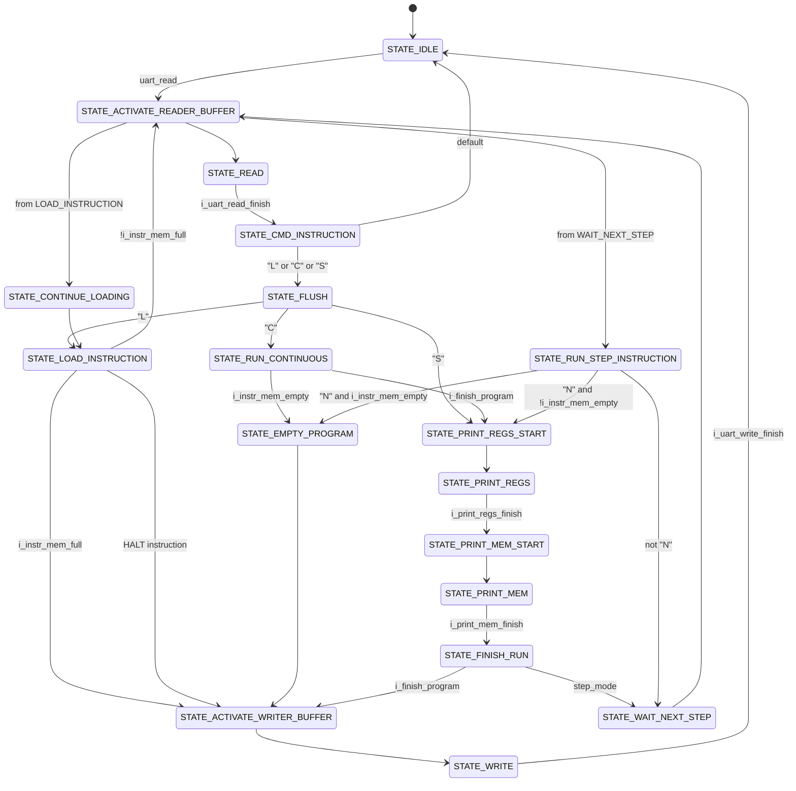

# MIPS Pipeline implemented in Basys3 FPGA
All the details of this implementation can be found in the .pdf file

## Debug Unit State Machine 

### State Machine Overview

#### `STATE_IDLE`
- **Description**: Initial state of the system. Reached after reset or when a command execution is completed.
- **Use case**: Waiting for a new command.

#### `STATE_ACTIVATE_READER_BUFFER`
- **Transitions**:
  - From `STATE_IDLE` when ready to read a command.
  - From `STATE_LOAD_INSTRUCTION` when loading more instructions.
  - From `STATE_WAIT_NEXT_STEP` in step mode.
- **Use case**: Preparing to read data from UART.

#### `STATE_READ`
- **Transitions**: Always reached from `STATE_ACTIVATE_READER_BUFFER`.
- **Use case**: Reading data from UART.

#### `STATE_CMD_INSTRUCTION`
- **Transitions**: Reached from `STATE_READ` when UART reading is complete.
- **Use case**: Interpreting the received command (Load, Continuous, or Step mode).

#### `STATE_FLUSH`
- **Transitions**: Reached from `STATE_CMD_INSTRUCTION` for "L", "C", or "S" commands.
- **Use case**: Resetting stages before executing a new command.

#### `STATE_LOAD_INSTRUCTION`
- **Transitions**:
  - From `STATE_FLUSH` after "L" command.
  - From `STATE_CONTINUE_LOADING` in a loop while loading instructions.
- **Use case**: Loading a new program into instruction memory.

#### `STATE_CONTINUE_LOADING`
- **Transitions**: Reached from `STATE_READ` when loading instructions.
- **Use case**: Continuing to load the next instruction.

#### `STATE_RUN_CONTINUOUS`
- **Transitions**: Reached from `STATE_FLUSH` after "C" command.
- **Use case**: Running the program continuously.

#### `STATE_PRINT_REGS_START`
- **Transitions**:
  - From `STATE_FLUSH` after "S" command (step mode).
  - From `STATE_RUN_CONTINUOUS` when program finishes.
  - From `STATE_RUN_STEP_INSTRUCTION` after each step.
- **Use case**: Initiating the process of printing registers.

#### `STATE_PRINT_REGS`
- **Transitions**: Always reached from `STATE_PRINT_REGS_START`.
- **Use case**: Printing register contents.

#### `STATE_PRINT_MEM_START`
- **Transitions**: Reached from `STATE_PRINT_REGS` when register printing is finished.
- **Use case**: Initiating the process of printing memory.

#### `STATE_PRINT_MEM`
- **Transitions**: Always reached from `STATE_PRINT_MEM_START`.
- **Use case**: Printing memory contents.

#### `STATE_FINISH_RUN`
- **Transitions**: Reached from `STATE_PRINT_MEM` when memory printing is finished.
- **Use case**: Finalizing the execution of a step or the entire program.

#### `STATE_ACTIVATE_WRITER_BUFFER`
- **Transitions**:
  - From `STATE_LOAD_INSTRUCTION` when instruction memory is full or HALT instruction is encountered.
  - From `STATE_EMPTY_PROGRAM` to report an error.
  - From `STATE_FINISH_RUN` to report step completion or program end.
- **Use case**: Preparing to write data to UART.

#### `STATE_WRITE`
- **Transitions**: Always reached from `STATE_ACTIVATE_WRITER_BUFFER`.
- **Use case**: Writing data to UART.

#### `STATE_EMPTY_PROGRAM`
- **Transitions**: Reached from `STATE_RUN_CONTINUOUS` or `STATE_RUN_STEP_INSTRUCTION` when instruction memory is empty.
- **Use case**: Handling the case when there's no program loaded.

#### `STATE_RUN_STEP_INSTRUCTION`
- **Transitions**: Reached from `STATE_READ` after receiving "N" command in step mode.
- **Use case**: Executing a single instruction in step mode.

#### `STATE_WAIT_NEXT_STEP`
- **Transitions**:
  - From `STATE_RUN_STEP_INSTRUCTION` when not receiving "N" command.
  - From `STATE_FINISH_RUN` in step mode.
- **Use case**: Waiting for the next step command in step mode.

###  Step-by-step mode

* The system clock is always running, but the MIPS processor only executes instructions when mips_enabled is high.
* In step-by-step mode, the mips_enabled signal is carefully controlled to allow only one instruction execution at a time. This is primarily handled in the STATE_RUN_STEP_INSTRUCTION state of the debug interface state machine.

* When a step command ("N" for Next) is received, the system does the following:
    * It sets mips_enabled_next to 1'b1, allowing the MIPS processor to execute one instruction.
    * It then immediately transitions to STATE_PRINT_REGS_START, which will disable the MIPS processor after the instruction execution.
*In the STATE_PRINT_REGS_START state, the system disables the MIPS processor
* The system then goes through the process of printing registers and memory, before returning to STATE_FINISH_RUN and then STATE_WAIT_NEXT_STEP, where it waits for the next step command.

